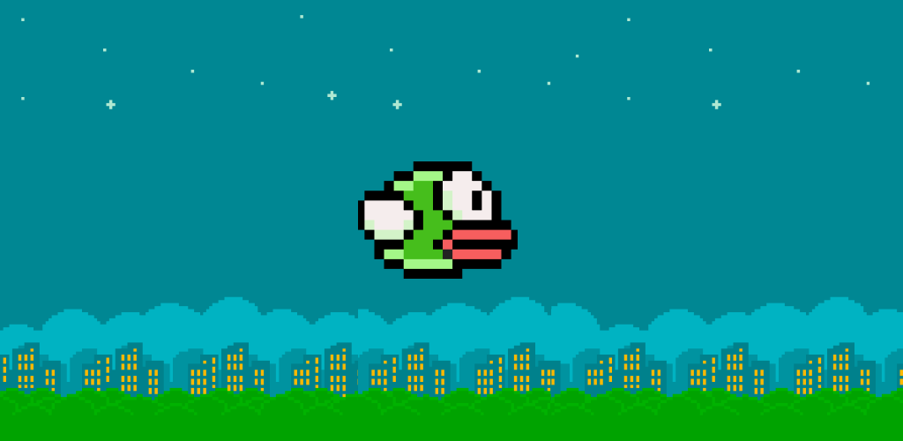
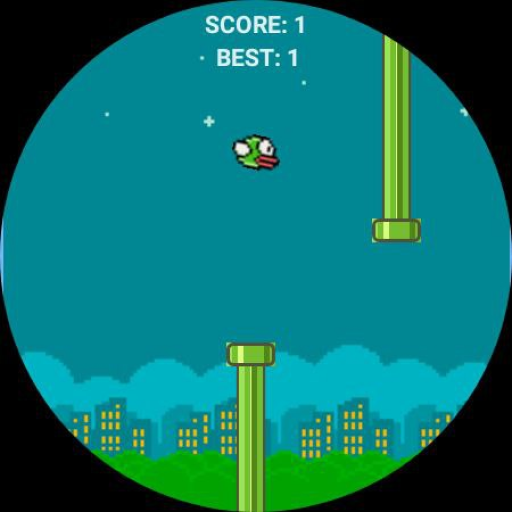
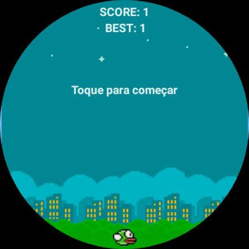
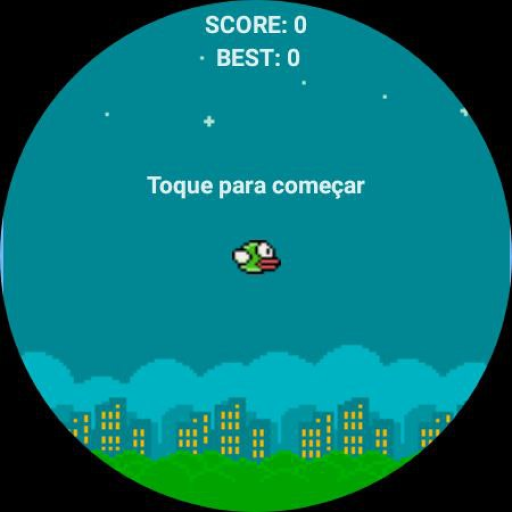

# Bird Tap (App para WearOS)

## Descrição

Prepare-se para embarcar em uma jornada emocionante e viciante que vai testar suas habilidades e reflexos ao máximo. Inspirado pelo clássico Flappy Bird, o Bird Tap é um jogo incrível projetado para dispositivos Wear OS, que vai te cativar desde o primeiro toque na tela.

## Tecnologias utilizadas

## Preview

